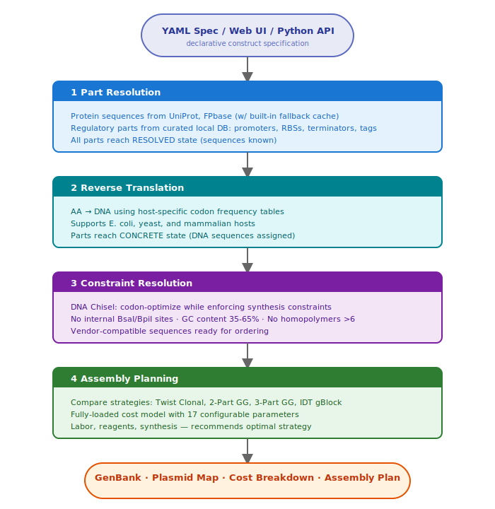
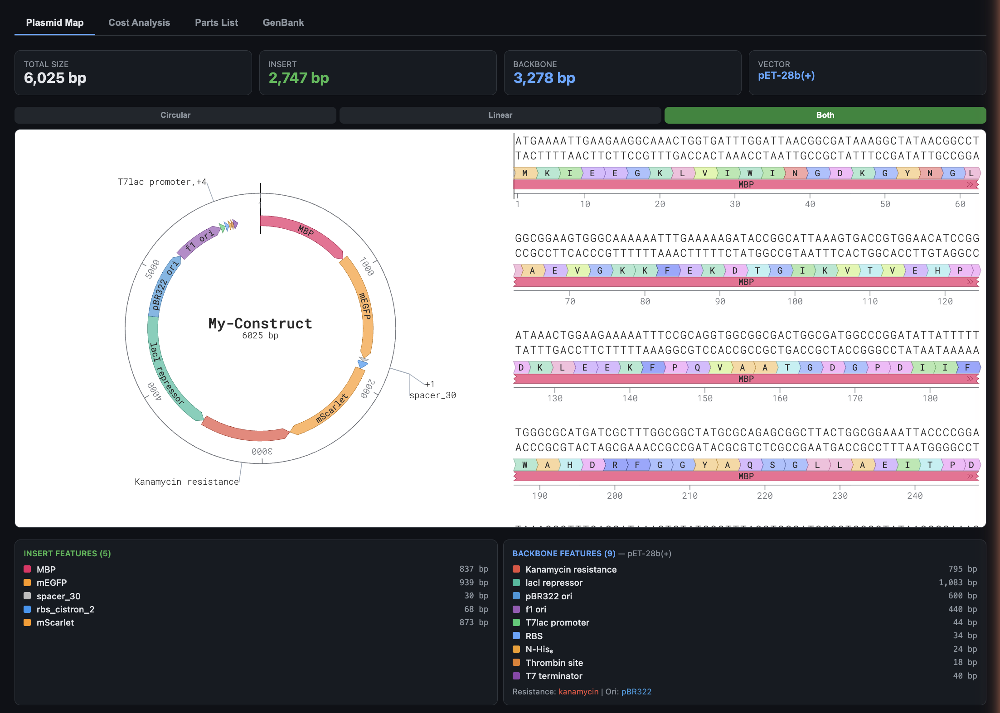
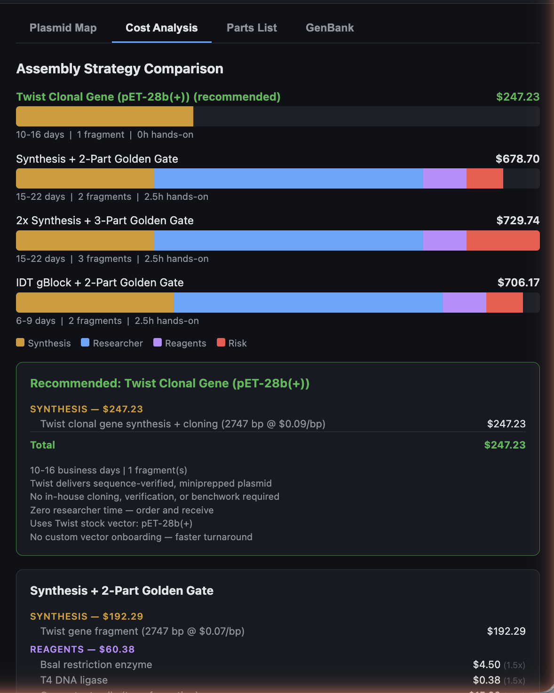
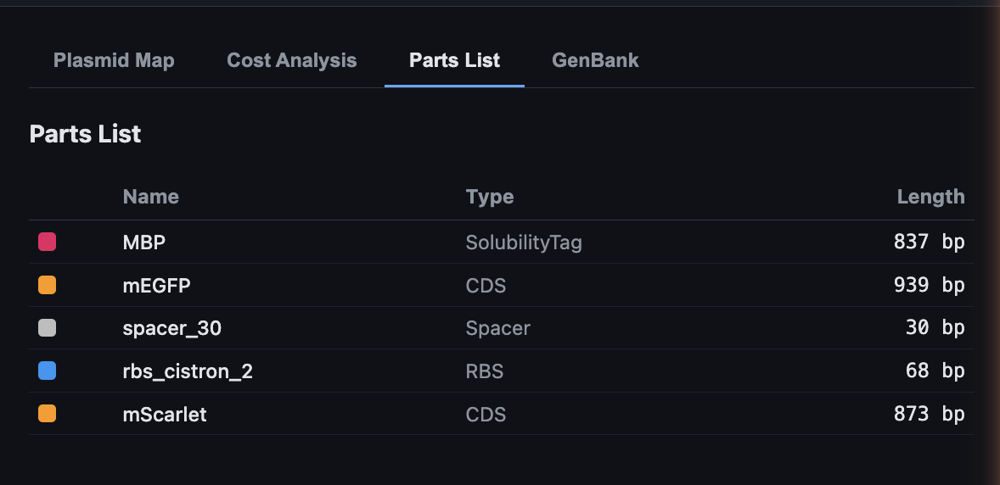
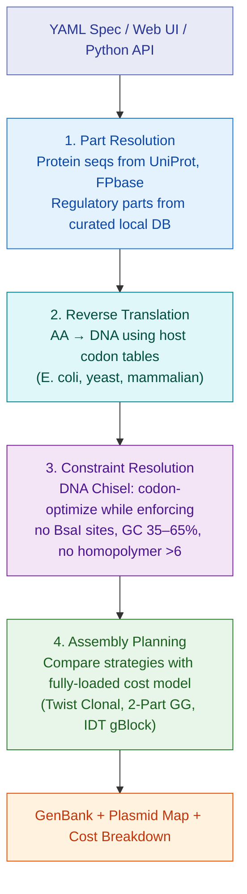
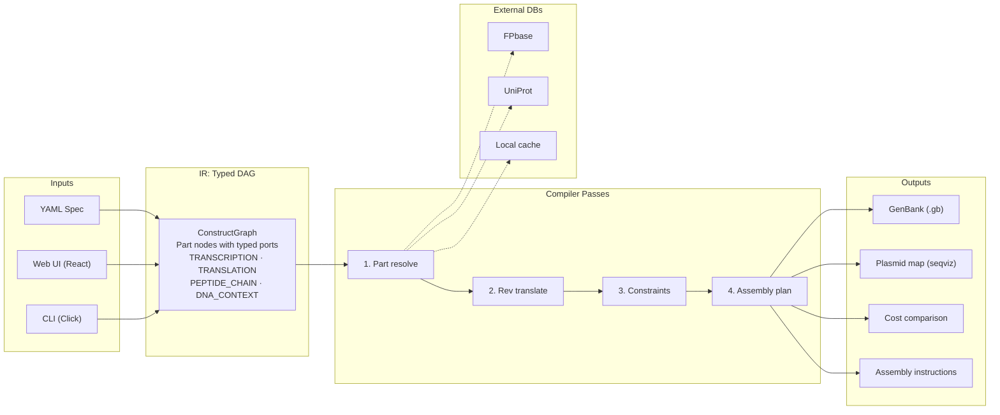

# construct-compiler

> **Note:** This project is under active development and APIs, file formats, and behavior may change significantly between commits. Not yet recommended for production use.

A conversational genetic construct design compiler. Describe what you want to express in plain English — through [Claude Code](https://docs.anthropic.com/en/docs/agents-and-tools/claude-code/overview), [gemini-cli](https://github.com/google-gemini/gemini-cli), or any MCP-compatible agent — and the compiler produces annotated DNA sequences, assembly plans, plasmid maps, vendor cost estimates, and GenBank files. No YAML knowledge required: the LLM drafts the spec, compiles it, validates it, and iterates until every check passes.

Also usable as a traditional CLI tool or through the visual web UI for hands-on design. Supports **E. coli**, **mammalian**, and **lentiviral** expression systems with 23 catalog vectors spanning Twist Bioscience's full product line.

<p align="center">
  
</p>

---

## Quick start

```bash
# Install (editable, with dev + web extras)
pip install -e ".[dev,web]"

# Launch the web UI at http://localhost:8421
python -m construct_compiler.server
```

---

## Four ways to use it

### 1. Conversational / LLM agent (recommended)

The primary interface. Describe your construct in plain English and let the agent handle everything — YAML generation, compilation, validation, and iteration. Works with any MCP-compatible coding agent:

**Claude Code:**

```bash
pip install -e ".[mcp]"
```

Add to your project's `.mcp.json`:

```json
{
  "mcpServers": {
    "construct-compiler": {
      "command": "construct-compiler-mcp"
    }
  }
}
```

**gemini-cli** and other MCP-compatible agents use the same server configuration.

Example conversation:

> *"I need a polycistronic construct with His-TEV-MBP-EGFP as the main target and mScarlet as a reporter, in BL21(DE3)."*

The agent drafts a YAML spec, compiles it, runs all four validity checks, and presents you with annotated DNA, an assembly plan, and a cost estimate — no manual YAML editing needed.

Three MCP tools are exposed:

| Tool | Description |
|------|-------------|
| `compile_spec` | Full pipeline compilation → parts list, assembly strategies with costs, optional GenBank |
| `check_spec` | 4 validity checks (reading frame, start codons, translation fidelity, internal stops) → pass/fail + score |
| `evaluate_variants` | Combinatorial design space exploration (up to 50 variants) → ranked results |

Validated specs are auto-saved to `examples/agent_generated/` and become permanent regression tests.

### 2. Web UI (interactive visual design)

```bash
python -m construct_compiler.server
# Open http://localhost:8421
```

The web UI gives you a visual construct builder with:

- Catalog vector selector with categorized dropdown (E. coli, Mammalian, Lentiviral, Cloning/Gateway)
- Per-cistron configuration: expression level, gene source (FPbase/UniProt), N-term tags, cleavage sites, solubility tags
- Interactive plasmid map via [seqviz](https://github.com/Lattice-Automation/seqviz) — circular, linear, or split view with color-coded annotations
- Side-by-side cost comparison of assembly strategies
- One-click GenBank export and YAML spec download



| Cost Analysis | Parts List |
|:---:|:---:|
|  |  |

### 3. CLI

```bash
# Compile a YAML spec — outputs cost comparison + GenBank
construct-compiler compile examples/his_tev_mbp_egfp.yaml -o output/

# Cost comparison only (quiet mode)
construct-compiler compile examples/his_tev_mbp_egfp.yaml --cost-only -q

# Override cost parameters for contract pricing
construct-compiler compile spec.yaml --sequencing-cost 15.0 --competent-cells-cost 8.0

# Validate without compiling
construct-compiler validate spec.yaml

# Run validity checks (reading frame, start codons, translation fidelity, internal stops)
construct-compiler check spec.yaml
construct-compiler check spec.yaml --json

# List available parts in the database
construct-compiler parts --list tags
construct-compiler parts --list promoters
```

### 4. Python API

```python
from construct_compiler import compile_construct, export_genbank

graph, plan = compile_construct("my_construct.yaml")
export_genbank(graph, "my_construct.gb")
print(plan.summary())
```

With custom cost parameters:

```python
from construct_compiler.passes.assembly_planning import CostParams

params = CostParams(
    researcher_hourly_rate=100.0,   # your lab's rate
    twist_gene_per_bp=0.06,         # volume discount
    overhead_multiplier=1.65,       # institutional overhead
    plasmidsaurus_sequencing=15.0,  # whole-plasmid sequencing
)
graph, plan = compile_construct("spec.yaml", cost_params=params)
```

---

## Validation & automated testing

The compiler includes a validation harness that checks every compiled construct for biological correctness. Use it to gate designs before synthesis, or to sweep a design space and rank variants automatically.

### What gets checked

1. **Reading frame continuity** — every coding part's DNA is codon-aligned (length divisible by 3), no frame drift across fusion chains
2. **Start codon placement** — the first coding element in each cistron starts with ATG, including when it's a tag rather than a CDS
3. **Translation fidelity** — translating the final DNA back to protein matches the expected sequence, even after codon optimization
4. **Internal stop codons** — no premature stops within coding regions or at part junctions in fusion chains

### CLI

```bash
# Check a single spec (exit code 0 = pass, 1 = fail)
construct-compiler check examples/his_tev_mbp_egfp.yaml

# JSON output for machine consumption
construct-compiler check spec.yaml --json

# Batch mode
construct-compiler check variants/*.yaml

# With intermediate pipeline stage diagnostics
construct-compiler check spec.yaml --intermediate -v
```

### Python API

```python
from construct_compiler.validation import evaluate_spec, evaluate_batch
from construct_compiler.validation.variants import DesignAxis, vary_spec_dicts

# Single spec
result = evaluate_spec("spec.yaml")
assert result.passed, result.summary()
print(result.score)           # 0.0–1.0
print(result.insert_length_bp)
print(result.cistron_count)

# Sweep a design space: 3 expression levels × 4 spacer lengths = 12 variants
axes = [
    DesignAxis("expression", "cassette.1.cistron.expression", ["high", "medium", "low"]),
    DesignAxis("spacer", "cassette.2.spacer", [20, 30, 50, 100]),
]
specs = vary_spec_dicts("spec.yaml", axes)
results = evaluate_batch(specs, skip_constraints=True)
best = results[0]  # sorted by score descending
```

### Runner script

```bash
# Evaluate a single spec
python scripts/design_evaluate.py examples/his_tev_mbp_egfp.yaml

# Sweep expression level and spacer length
python scripts/design_evaluate.py examples/his_tev_mbp_egfp.yaml \
    --axes "expression=high,medium,low" "spacer=20,30,50"

# Fast mode (skip codon optimization) with JSON output
python scripts/design_evaluate.py spec.yaml --fast --json
```

### LLM eval harness

The eval harness tests the full natural-language → YAML spec → compilation → validation loop. It sends prompts to the Anthropic API, parses the generated specs, compiles them, and checks both harness validity and expectation properties (host, cistron count, required parts).

```bash
# Run the default 250-prompt eval (requires ANTHROPIC_API_KEY)
python evals/run_eval.py

# Use a specific corpus
python evals/run_eval.py --corpus evals/prompt_corpus_v2.yaml

# Run with parallel API calls (recommended: 5 workers)
python evals/run_eval.py -j 5

# Explicit rate limit (requests per minute)
python evals/run_eval.py -j 5 --rpm 50

# Run a single prompt or category
python evals/run_eval.py --id basic_gfp
python evals/run_eval.py --category polycistronic

# Re-evaluate previously generated specs (no API calls)
python evals/run_eval.py --reeval

# Name the results file
python evals/run_eval.py --run-name my_experiment
```

Three prompt corpora are included (750 prompts total across 10 categories):

| Corpus | File | Description |
|--------|------|-------------|
| v1 | `evals/prompt_corpus.yaml` | Original 250 prompts (tuning set) |
| v2 | `evals/prompt_corpus_v2.yaml` | Fresh 250 prompts (holdout validation) |
| v3 | `evals/prompt_corpus_v3.yaml` | Fresh 250 prompts (includes split-GFP tags) |

Categories: basic, tags, polycistronic, edge_cases, constraints, realistic, mammalian, lentiviral, stress, robustness. Results are written to `evals/results/` as structured JSON.

### Test suite

```bash
# Run all tests (validators, harness, variants, MCP server, regression)
pytest tests/ -v

# Fast mode — skip codon optimization tests
pytest tests/ -v -m "not slow"
```

The test suite validates at every pipeline stage — after parsing, after part resolution, after reverse translation, and after constraint resolution — to catch exactly where issues are introduced. The regression suite auto-discovers example specs (including agent-generated ones), so the test corpus grows as you design constructs through Claude Code.

---

## Compilation pipeline

The compiler lowers a high-level construct description through four passes into concrete, annotated DNA with a costed build plan:



---

## Construct spec reference

### Backbone

Use a **catalog vector** (recommended) or define a **custom backbone**:

```yaml
# Catalog vector — auto-configures resistance, ori, promoter, tags
backbone:
  catalog_vector: pET-28b(+)

# Custom backbone
backbone:
  resistance: kanamycin
  ori: pBR322
  source: addgene
  addgene_id: 26094
```

### Catalog vectors (23 vectors, 4 categories)

| Category | Vector | Size | Resistance | Key features |
|----------|--------|-----:|------------|--------------|
| **E. coli Expression** | pET-21a(+) | 5,443 bp | Amp | T7lac, optional C-His |
| | pET-28a(+) | 5,369 bp | Kan | N-His + Thrombin |
| | pET-28b(+) | 5,368 bp | Kan | N-His + Thrombin (alt MCS) |
| | pET-32a(+) | 5,900 bp | Amp | Trx-His-S-Enterokinase |
| | pRSET A/B/C | ~2,900 bp | Amp | High copy (pUC), N-His |
| | pUC19 | 2,686 bp | Amp | Cloning only (pUC ori) |
| **Mammalian Expression** | pTwist CMV | 4,831 bp | — | Transient expression |
| | pTwist CMV BetaGlobin | 4,893 bp | — | + β-globin intron |
| | pTwist CMV BG WPRE Neo | 6,737 bp | Neo/G418 | + WPRE element |
| | pTwist CMV Hygro | 6,694 bp | Hygromycin | Stable selection |
| | pTwist CMV Puro | 6,633 bp | Puromycin | Stable selection |
| | pTwist CMV OriP | 4,893 bp | — | Episomal (EBV OriP) |
| | pTwist EF1 Alpha | 6,633 bp | — | Sustained expression |
| | pTwist EF1 Alpha Puro | 7,200 bp | Puromycin | + selection |
| **Lentiviral** | pTwist Lenti SFFV | 5,683 bp | — | 3rd-gen SIN-LTR |
| | pTwist Lenti SFFV Puro | 7,100 bp | Puromycin | + selection |
| | pTwist Lenti EF1 Alpha | 6,800 bp | — | Broad expression |
| **Cloning / Gateway** | pTwist Amp | 2,221 bp | Amp | Minimal cloning |
| | pTwist Kan | 2,365 bp | Kan | M13 priming sites |
| | pTwist ENTR | 2,365 bp | Kan | attL1/attL2 |
| | pTwist ENTR Kozak | 2,421 bp | Kan | + Kozak for mammalian |

### Promoters

Built-in: `T7`, `T7lac`, `tac`, `araBAD`, `lacUV5`, `J23100` (constitutive, strong), `J23106` (constitutive, medium).

Mammalian/lentiviral promoters (`CMV`, `EF1a`, `SFFV`) are provided by catalog vectors.

### RBS / expression levels

Specify an expression level and the compiler picks a context-insensitive bicistronic design (BCD) element, or name a part directly:

```yaml
cistron:
  expression: high    # auto-selects BCD2
  # or
  rbs: BBa_B0034      # explicit RBS
```

| Level | Default part | Relative strength |
|-------|-------------|-------------------|
| high | BCD2 | 1.0 |
| medium | BCD12 | 0.2 |
| low | BCD22 | 0.05 |
| very_low | BBa_B0033 | 0.01 |

### Fusion tags and cleavage sites

Tags and cleavage sites can be specified in a `chain` (ordered, explicit) or as `n_tag`/`c_tag` shorthand:

```yaml
# Chain syntax — each element individually annotated on the plasmid map
chain:
  - tag: 6xHis
  - cleavage_site: TEV
  - solubility_tag: MBP
  - linker: {type: GS_flexible, repeats: 3}
  - gene: {id: mEGFP, source: fpbase}

# Shorthand syntax
n_tag: [6xHis, TEV]
gene: {id: mEGFP, source: fpbase}
c_tag: Strep-II
```

**Purification tags:** `6xHis`, `8xHis`, `Strep-II`, `Twin-Strep`, `FLAG`, `HA`

**Solubility tags:** `MBP`, `GST`, `SUMO`, `Trx`

**Cleavage sites:** `TEV`, `3C`, `Factor_Xa`, `Thrombin`, `Enterokinase`

**Linkers:** `GS_flexible` (GGGGS)n, `rigid_EAAAK` (EAAAK)n, `short_GS`

### Polycistronic designs

Multiple `cistron` blocks under a single promoter, separated by spacers:

```yaml
cassette:
  - promoter: T7lac
  - cistron:
      label: target
      expression: high
      chain:
        - tag: 6xHis
        - cleavage_site: TEV
        - gene: {id: P12345, source: uniprot}
  - spacer: 30
  - cistron:
      label: reporter
      expression: low
      fused: false
      gene: {id: mScarlet-I, source: fpbase}
  - terminator: rrnB_T1
```

### Constraints

```yaml
constraints:
  assembly: golden_gate
  enzyme: BsaI               # BsaI, BpiI, BbsI
  codon_optimization: local   # DNA Chisel
  gc_window: [0.35, 0.65]
  max_homopolymer: 6
```

---

## Cost model

The assembly planner compares strategies using a fully-loaded cost model. All 17 parameters are configurable via the web UI, CLI flags, or Python API:

| Parameter | Default |
|-----------|--------:|
| Researcher hourly rate | $150/hr |
| Overhead multiplier | 1.5x |
| Twist gene synthesis | $0.07/bp |
| Twist clonal gene | $0.09/bp |
| IDT gBlock | $0.08/bp |
| BsaI restriction enzyme | $3.00/rxn |
| T4 DNA ligase | $0.25/rxn |
| Competent cells | $10.00/rxn |
| Plates + antibiotics | $2.00/rxn |
| Colony PCR screening | $5.00/rxn |
| Miniprep kit | $5.00/rxn |
| Plasmidsaurus sequencing | $15.00/rxn |
| Golden Gate setup labor | 1.5 hrs |
| Colony screening labor | 0.0 hrs * |
| Miniprep + sequencing labor | 1.0 hrs |
| Troubleshooting (per retry) | 3.0 hrs |
| 2-part / 3-part GG success rate | 90% / 80% |

\* Colony screening labor is zero — automated by colony picking robots.

### Example output: His-TEV-MBP-mEGFP (~3 kb insert)

```
Strategy: Twist Clonal Gene ★ RECOMMENDED
  Twist clonal gene synthesis (3015 bp @ $0.09/bp)         $271.35
  ─────────────────────────────────────────────────────────────────
  TOTAL                                                     $271.35
  Turnaround: 12-18 business days
  Notes: Zero benchwork — order and receive sequence-verified plasmid

Strategy: Synthesis + 2-Part Golden Gate
  Twist gene synthesis (3015 bp @ $0.07/bp)                $211.05
  BsaI + T4 ligase + competent cells + plates (1.5× OH)    $23.63
  Plasmidsaurus sequencing                                  $22.50
  Researcher time (2.5 hrs @ $150/hr)                      $375.00
  ─────────────────────────────────────────────────────────────────
  TOTAL                                                     $632.18
  Turnaround: ~10 business days
```

---

## Architecture



The IR is a directed graph where nodes are genetic parts with typed ports. Port types (TRANSCRIPTION, TRANSLATION_INIT, PEPTIDE_CHAIN, DNA_CONTEXT) enforce biological validity at composition time — putting a terminator after a promoter with no coding sequence in between is a type error.

---

## Project structure

```
construct_compiler/
├── src/construct_compiler/
│   ├── __main__.py          # CLI entry point (compile, check, validate, parts)
│   ├── server.py            # FastAPI server + REST API
│   ├── mcp_server.py        # MCP server for Claude Code (stdio transport)
│   ├── core/                # IR: types, parts, graph, port system
│   ├── frontend/            # YAML parser (spec → IR graph)
│   ├── passes/              # Compiler passes + assembly cost model
│   │   ├── part_resolution.py
│   │   ├── reverse_translation.py
│   │   ├── constraint_resolution.py
│   │   ├── assembly_planning.py
│   │   └── pipeline.py
│   ├── validation/          # In silico construct validation
│   │   ├── construct_checks.py  # 4 validators (frame, start, fidelity, stops)
│   │   ├── harness.py           # Evaluation engine (evaluate_spec, evaluate_batch)
│   │   └── variants.py          # Parametric design space generator
│   ├── backends/            # GenBank export (+ future SBOL3)
│   ├── vendors/             # Twist, IDT API stubs
│   ├── data/                # Curated parts DB (23 vectors, codon
│   │   └── parts_db.py      #   tables, overhang sets)
│   └── plugins/             # Plugin system (future)
├── tests/                   # pytest suite (49+ tests)
│   ├── conftest.py          # Fixtures at each pipeline stage
│   ├── test_construct_validity.py  # Validator unit + integration tests
│   ├── test_harness.py      # Harness + variant generator tests
│   ├── test_harness_regression.py  # Auto-discovered regression tests
│   ├── test_harness_variants.py    # Variant evaluation smoke tests
│   └── test_mcp_server.py   # MCP tool handler tests
├── evals/                   # LLM eval harness
│   ├── run_eval.py          # Eval runner (parallel, rate-limited)
│   ├── spec_generation_prompt.txt  # System prompt for spec generation
│   ├── prompt_corpus.yaml   # 250 eval prompts (v1)
│   ├── prompt_corpus_v2.yaml  # 250 eval prompts (v2, holdout)
│   ├── prompt_corpus_v3.yaml  # 250 eval prompts (v3, split-GFP)
│   ├── generated_specs/     # Cached LLM outputs for re-eval
│   └── results/             # Structured JSON eval results
├── scripts/
│   └── design_evaluate.py   # Standalone design-evaluate runner
├── frontend/
│   └── index.html           # React SPA + seqviz plasmid viewer
├── examples/
│   ├── his_tev_mbp_egfp.yaml
│   ├── agent_generated/     # Auto-saved specs from Claude Code sessions
│   └── run_example.py
├── pyproject.toml
└── README.md
```

---

## API reference

### REST endpoints

| Method | Endpoint | Description |
|--------|----------|-------------|
| `POST` | `/api/compile` | Compile a construct spec → plasmid map + cost plan |
| `GET` | `/api/vectors/catalog` | All 23 catalog vectors |
| `GET` | `/api/vectors/catalog/mammalian` | 8 mammalian expression vectors |
| `GET` | `/api/vectors/catalog/lentiviral` | 3 lentiviral transfer vectors |
| `GET` | `/api/vectors/catalog/cloning` | 4 cloning/Gateway vectors |
| `GET` | `/api/vectors/categories` | Vectors grouped by category |
| `GET` | `/api/parts/{category}` | List parts (promoters, tags, etc.) |

### Compile request body

```json
{
  "spec": { "construct": { ... } },
  "cost_params": {
    "researcher_hourly_rate": 150,
    "twist_clonal_per_bp": 0.09,
    "plasmidsaurus_sequencing": 15.0
  }
}
```

---

## Vendor integration

Twist and IDT vendor plugins support screening, codon optimization, and ordering via their APIs. Set credentials as environment variables:

```bash
export TWIST_API_KEY=your_key
export TWIST_API_SECRET=your_secret

export IDT_CLIENT_ID=your_id
export IDT_CLIENT_SECRET=your_secret
```

Without credentials, the plugins run in mock mode with heuristic feasibility checks and pricing estimates.

---

## Roadmap

- [x] Variant library fan-out (compile N constructs from parameterized specs) — `vary_spec()` + `evaluate_batch()` + `design_evaluate.py` runner
- [x] Construct validation harness (reading frame, start codons, translation fidelity, internal stops)
- [x] MCP server for Claude Code — agent-driven design with `compile_spec`, `check_spec`, `evaluate_variants` tools
- [x] Automated regression testing — auto-discovered specs, CI-ready with fast/slow markers
- [x] LLM eval harness — 750 prompts across 3 corpora, parallel execution, rate-limited API calls
- [x] Assembled view — merges insert + backbone features with real DNA sequences from GenBank annotations
- [x] Restriction site-aware cloning pair inference — auto-selects best RE pair based on insert vs backbone features
- [ ] Live Twist/IDT API integration (screening + vendor codon optimization)
- [ ] Protocol generation backend (human-readable step-by-step assembly instructions)
- [ ] Primer design backend (primer3-py for Golden Gate primers with overhangs)
- [ ] SBOL3 export via pySBOL3
- [ ] Addgene backbone fetching (auto-download backbone sequences by ID)
- [ ] Salis RBS Calculator integration for computed translation initiation rates
- [ ] Verification targets (expected digest fragments, colony PCR bands)
- [ ] Mammalian codon optimization tables
- [ ] Multi-plasmid systems (co-transformation, lentiviral packaging sets)

---

## Acknowledgments

This project builds on excellent work from the synthetic biology and open-source communities:

- **[Biopython](https://biopython.org/)** — sequence manipulation, GenBank export, and restriction enzyme analysis
- **[DNA Chisel](https://edinburgh-genome-foundry.github.io/DnaChisel/)** — codon optimization and constraint resolution engine
- **[iGEM Registry of Standard Biological Parts](http://parts.igem.org/)** — RBS and terminator sequences (BBa_B0034, BBa_B0032, BBa_B0015, and others)
- **[Mutalik et al. (2013)](https://doi.org/10.1038/nmeth.2404)** — bicistronic design (BCD) elements for context-insensitive translation initiation
- **[Potapov et al. (2018)](https://doi.org/10.1021/acssynbio.8b00242)** — high-fidelity Golden Gate overhang sets
- **[Twist Bioscience](https://www.twistbioscience.com/)** — catalog vector specifications and synthesis parameters
- **[FPbase](https://www.fpbase.org/)** — fluorescent protein sequences and spectral data

---

## License

MIT
