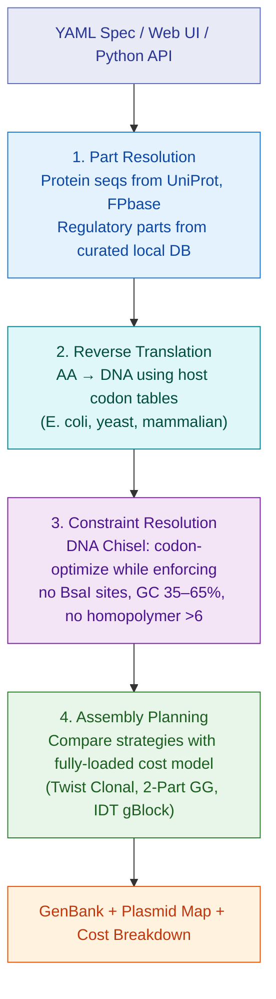
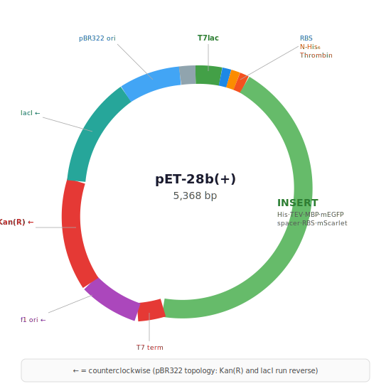
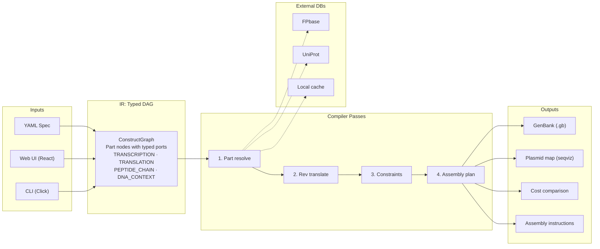

# construct-compiler

> **Note:** This project is under active development and APIs, file formats, and behavior may change significantly between commits. Not yet recommended for production use.

A genetic construct design compiler for *in silico* DNA automation. Write a declarative YAML spec — or use the visual web UI — describing what you want to express, and the compiler produces annotated DNA sequences, assembly plans, plasmid maps, vendor cost estimates, and GenBank files.

Supports **E. coli**, **mammalian**, and **lentiviral** expression systems with 23 catalog vectors spanning Twist Bioscience's full product line.

<p align="center">
  
</p>

---

## Quick start

```bash
# Install (editable, with dev + web extras)
pip install -e ".[dev,web]"

# Launch the web UI at http://localhost:8421
python -m construct_compiler.server
```

---

## Three ways to use it

### 1. Web UI (recommended for interactive design)

```bash
python -m construct_compiler.server
# Open http://localhost:8421
```

The web UI gives you a visual construct builder with:

- Catalog vector selector with categorized dropdown (E. coli, Mammalian, Lentiviral, Cloning/Gateway)
- Per-cistron configuration: expression level, gene source (FPbase/UniProt), N-term tags, cleavage sites, solubility tags
- Interactive plasmid map via [seqviz](https://github.com/Lattice-Automation/seqviz) — circular, linear, or split view with color-coded annotations
- Side-by-side cost comparison of assembly strategies
- One-click GenBank export and YAML spec download


| Cost Analysis | Parts List |
|:---:|:---:|
|  |  |

### 2. CLI

```bash
# Compile a YAML spec — outputs cost comparison + GenBank
construct-compiler compile examples/his_tev_mbp_egfp.yaml -o output/

# Cost comparison only (quiet mode)
construct-compiler compile examples/his_tev_mbp_egfp.yaml --cost-only -q

# Override cost parameters for contract pricing
construct-compiler compile spec.yaml --sequencing-cost 15.0 --competent-cells-cost 8.0

# Validate without compiling
construct-compiler validate spec.yaml

# List available parts in the database
construct-compiler parts --list tags
construct-compiler parts --list promoters
```

### 3. Python API

```python
from construct_compiler import compile_construct, export_genbank

graph, plan = compile_construct("my_construct.yaml")
export_genbank(graph, "my_construct.gb")
print(plan.summary())
```

With custom cost parameters:

```python
from construct_compiler.passes.assembly_planning import CostParams

params = CostParams(
    researcher_hourly_rate=100.0,   # your lab's rate
    twist_gene_per_bp=0.06,         # volume discount
    overhead_multiplier=1.65,       # institutional overhead
    plasmidsaurus_sequencing=15.0,  # whole-plasmid sequencing
)
graph, plan = compile_construct("spec.yaml", cost_params=params)
```

---

## Compilation pipeline

The compiler lowers a high-level construct description through four passes into concrete, annotated DNA with a costed build plan:



---

## Construct spec reference

### Backbone

Use a **catalog vector** (recommended) or define a **custom backbone**:

```yaml
# Catalog vector — auto-configures resistance, ori, promoter, tags
backbone:
  catalog_vector: pET-28b(+)

# Custom backbone
backbone:
  resistance: kanamycin
  ori: pBR322
  source: addgene
  addgene_id: 26094
```

### Catalog vectors (23 vectors, 4 categories)

| Category | Vector | Size | Resistance | Key features |
|----------|--------|-----:|------------|--------------|
| **E. coli Expression** | pET-21a(+) | 5,443 bp | Amp | T7lac, optional C-His |
| | pET-28a(+) | 5,369 bp | Kan | N-His + Thrombin |
| | pET-28b(+) | 5,368 bp | Kan | N-His + Thrombin (alt MCS) |
| | pET-32a(+) | 5,900 bp | Amp | Trx-His-S-Enterokinase |
| | pRSET A/B/C | ~2,900 bp | Amp | High copy (pUC), N-His |
| | pUC19 | 2,686 bp | Amp | Cloning only (pUC ori) |
| **Mammalian Expression** | pTwist CMV | 4,831 bp | — | Transient expression |
| | pTwist CMV BetaGlobin | 4,893 bp | — | + β-globin intron |
| | pTwist CMV BG WPRE Neo | 6,737 bp | Neo/G418 | + WPRE element |
| | pTwist CMV Hygro | 6,694 bp | Hygromycin | Stable selection |
| | pTwist CMV Puro | 6,633 bp | Puromycin | Stable selection |
| | pTwist CMV OriP | 4,893 bp | — | Episomal (EBV OriP) |
| | pTwist EF1 Alpha | 6,633 bp | — | Sustained expression |
| | pTwist EF1 Alpha Puro | 7,200 bp | Puromycin | + selection |
| **Lentiviral** | pTwist Lenti SFFV | 5,683 bp | — | 3rd-gen SIN-LTR |
| | pTwist Lenti SFFV Puro | 7,100 bp | Puromycin | + selection |
| | pTwist Lenti EF1 Alpha | 6,800 bp | — | Broad expression |
| **Cloning / Gateway** | pTwist Amp | 2,221 bp | Amp | Minimal cloning |
| | pTwist Kan | 2,365 bp | Kan | M13 priming sites |
| | pTwist ENTR | 2,365 bp | Kan | attL1/attL2 |
| | pTwist ENTR Kozak | 2,421 bp | Kan | + Kozak for mammalian |

### Promoters

Built-in: `T7`, `T7lac`, `tac`, `araBAD`, `lacUV5`, `J23100` (constitutive, strong), `J23106` (constitutive, medium).

Mammalian/lentiviral promoters (`CMV`, `EF1a`, `SFFV`) are provided by catalog vectors.

### RBS / expression levels

Specify an expression level and the compiler picks a context-insensitive bicistronic design (BCD) element, or name a part directly:

```yaml
cistron:
  expression: high    # auto-selects BCD2
  # or
  rbs: BBa_B0034      # explicit RBS
```

| Level | Default part | Relative strength |
|-------|-------------|-------------------|
| high | BCD2 | 1.0 |
| medium | BCD12 | 0.2 |
| low | BCD22 | 0.05 |
| very_low | BBa_B0033 | 0.01 |

### Fusion tags and cleavage sites

Tags and cleavage sites can be specified in a `chain` (ordered, explicit) or as `n_tag`/`c_tag` shorthand:

```yaml
# Chain syntax — each element individually annotated on the plasmid map
chain:
  - tag: 6xHis
  - cleavage_site: TEV
  - solubility_tag: MBP
  - linker: {type: GS_flexible, repeats: 3}
  - gene: {id: mEGFP, source: fpbase}

# Shorthand syntax
n_tag: [6xHis, TEV]
gene: {id: mEGFP, source: fpbase}
c_tag: Strep-II
```

**Purification tags:** `6xHis`, `8xHis`, `Strep-II`, `Twin-Strep`, `FLAG`, `HA`

**Solubility tags:** `MBP`, `GST`, `SUMO`, `Trx`

**Cleavage sites:** `TEV`, `3C`, `Factor_Xa`, `Thrombin`, `Enterokinase`

**Linkers:** `GS_flexible` (GGGGS)n, `rigid_EAAAK` (EAAAK)n, `short_GS`

### Polycistronic designs

Multiple `cistron` blocks under a single promoter, separated by spacers:

```yaml
cassette:
  - promoter: T7lac
  - cistron:
      label: target
      expression: high
      chain:
        - tag: 6xHis
        - cleavage_site: TEV
        - gene: {id: P12345, source: uniprot}
  - spacer: 30
  - cistron:
      label: reporter
      expression: low
      fused: false
      gene: {id: mScarlet-I, source: fpbase}
  - terminator: rrnB_T1
```

### Constraints

```yaml
constraints:
  assembly: golden_gate
  enzyme: BsaI               # BsaI, BpiI, BbsI
  codon_optimization: local   # DNA Chisel
  gc_window: [0.35, 0.65]
  max_homopolymer: 6
```

---

## Plasmid map annotations

The compiler generates a fully annotated plasmid map with correct circular topology. Every element — insert parts, backbone features, and vector-provided cassette elements — is individually annotated and color-coded.

<p align="center">
  
</p>

For a polycistronic construct in pET-28b(+), the map reads clockwise from the insert: T7lac → RBS → N-His₆ → Thrombin → **INSERT** → T7 term → f1 ori(←) → Kan(R)(←) → lacI(←) → pBR322 ori → back to T7lac.

Features are placed with biologically accurate directions: on pBR322-based vectors, the resistance cassette and lacI run counterclockwise (←), matching standard pET map notation.

---

## Cost model

The assembly planner compares strategies using a fully-loaded cost model. All 17 parameters are configurable via the web UI, CLI flags, or Python API:

| Parameter | Default |
|-----------|--------:|
| Researcher hourly rate | $150/hr |
| Overhead multiplier | 1.5x |
| Twist gene synthesis | $0.07/bp |
| Twist clonal gene | $0.09/bp |
| IDT gBlock | $0.08/bp |
| BsaI restriction enzyme | $3.00/rxn |
| T4 DNA ligase | $0.25/rxn |
| Competent cells | $10.00/rxn |
| Plates + antibiotics | $2.00/rxn |
| Colony PCR screening | $5.00/rxn |
| Miniprep kit | $5.00/rxn |
| Plasmidsaurus sequencing | $15.00/rxn |
| Golden Gate setup labor | 1.5 hrs |
| Colony screening labor | 0.0 hrs * |
| Miniprep + sequencing labor | 1.0 hrs |
| Troubleshooting (per retry) | 3.0 hrs |
| 2-part / 3-part GG success rate | 90% / 80% |

\* Colony screening labor is zero — automated by colony picking robots.

### Example output: His-TEV-MBP-mEGFP (~3 kb insert)

```
Strategy: Twist Clonal Gene ★ RECOMMENDED
  Twist clonal gene synthesis (3015 bp @ $0.09/bp)         $271.35
  ─────────────────────────────────────────────────────────────────
  TOTAL                                                     $271.35
  Turnaround: 12-18 business days
  Notes: Zero benchwork — order and receive sequence-verified plasmid

Strategy: Synthesis + 2-Part Golden Gate
  Twist gene synthesis (3015 bp @ $0.07/bp)                $211.05
  BsaI + T4 ligase + competent cells + plates (1.5× OH)    $23.63
  Plasmidsaurus sequencing                                  $22.50
  Researcher time (2.5 hrs @ $150/hr)                      $375.00
  ─────────────────────────────────────────────────────────────────
  TOTAL                                                     $632.18
  Turnaround: ~10 business days
```

---

## Architecture



The IR is a directed graph where nodes are genetic parts with typed ports. Port types (TRANSCRIPTION, TRANSLATION_INIT, PEPTIDE_CHAIN, DNA_CONTEXT) enforce biological validity at composition time — putting a terminator after a promoter with no coding sequence in between is a type error.

---

## Project structure

```
construct_compiler/
├── src/construct_compiler/
│   ├── __main__.py          # CLI entry point (Click)
│   ├── server.py            # FastAPI server + REST API
│   ├── core/                # IR: types, parts, graph, port system
│   ├── frontend/            # YAML parser (spec → IR graph)
│   ├── passes/              # Compiler passes + assembly cost model
│   │   ├── part_resolution.py
│   │   ├── reverse_translation.py
│   │   ├── constraint_resolution.py
│   │   ├── assembly_planning.py
│   │   └── pipeline.py
│   ├── backends/            # GenBank export (+ future SBOL3)
│   ├── vendors/             # Twist, IDT API stubs
│   ├── data/                # Curated parts DB (23 vectors, codon
│   │   └── parts_db.py      #   tables, overhang sets)
│   └── plugins/             # Plugin system (future)
├── frontend/
│   └── index.html           # React SPA + seqviz plasmid viewer
├── examples/
│   ├── his_tev_mbp_egfp.yaml
│   └── run_example.py
├── pyproject.toml
└── README.md
```

---

## API reference

### REST endpoints

| Method | Endpoint | Description |
|--------|----------|-------------|
| `POST` | `/api/compile` | Compile a construct spec → plasmid map + cost plan |
| `GET` | `/api/vectors/catalog` | All 23 catalog vectors |
| `GET` | `/api/vectors/catalog/mammalian` | 8 mammalian expression vectors |
| `GET` | `/api/vectors/catalog/lentiviral` | 3 lentiviral transfer vectors |
| `GET` | `/api/vectors/catalog/cloning` | 4 cloning/Gateway vectors |
| `GET` | `/api/vectors/categories` | Vectors grouped by category |
| `GET` | `/api/parts/{category}` | List parts (promoters, tags, etc.) |

### Compile request body

```json
{
  "spec": { "construct": { ... } },
  "cost_params": {
    "researcher_hourly_rate": 150,
    "twist_clonal_per_bp": 0.09,
    "plasmidsaurus_sequencing": 15.0
  }
}
```

---

## Vendor integration

Twist and IDT vendor plugins support screening, codon optimization, and ordering via their APIs. Set credentials as environment variables:

```bash
export TWIST_API_KEY=your_key
export TWIST_API_SECRET=your_secret

export IDT_CLIENT_ID=your_id
export IDT_CLIENT_SECRET=your_secret
```

Without credentials, the plugins run in mock mode with heuristic feasibility checks and pricing estimates.

---

## Roadmap

- [ ] Variant library fan-out (compile N constructs from parameterized specs)
- [ ] Live Twist/IDT API integration (screening + vendor codon optimization)
- [ ] Protocol generation backend (human-readable step-by-step assembly instructions)
- [ ] Primer design backend (primer3-py for Golden Gate primers with overhangs)
- [ ] SBOL3 export via pySBOL3
- [ ] Addgene backbone fetching (auto-download backbone sequences by ID)
- [ ] Salis RBS Calculator integration for computed translation initiation rates
- [ ] Verification targets (expected digest fragments, colony PCR bands)
- [ ] Mammalian codon optimization tables
- [ ] Multi-plasmid systems (co-transformation, lentiviral packaging sets)

---

## License

MIT
