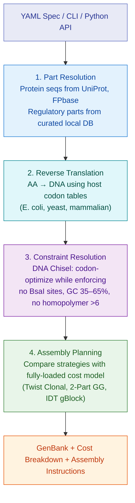

# construct-compiler

> **Note:** This project is under active development. APIs, file formats, and behavior may change significantly between commits. Not yet recommended for production use.

A genetic construct design compiler for polycistronic expression vectors. Describe what you want to express in plain English through [Claude Code](https://docs.anthropic.com/en/docs/agents-and-tools/claude-code/overview), [gemini-cli](https://github.com/google-gemini/gemini-cli), or any MCP-compatible agent — and the compiler produces annotated DNA sequences, assembly plans, vendor cost estimates, and GenBank files. The LLM drafts the YAML spec, compiles it, validates it, and iterates until every check passes.

Also usable as a standalone CLI tool or Python library. Supports **E. coli**, **mammalian**, and **lentiviral** expression systems with 23 catalog vectors spanning Twist Bioscience's full product line.

---

## Quick start

```bash
pip install -e ".[dev]"

# Compile a spec to GenBank + assembly plan
construct-compiler compile examples/his_tev_mbp_egfp.yaml -o output/

# Run validity checks
construct-compiler check examples/his_tev_mbp_egfp.yaml
```

---

## Three ways to use it

### 1. MCP agent (recommended)

The primary interface. Describe your construct in plain English and let the agent handle YAML generation, compilation, validation, and iteration.

```bash
pip install -e ".[mcp]"
```

Add to your project's `.mcp.json`:

```json
{
  "mcpServers": {
    "construct-compiler": {
      "command": "construct-compiler-mcp"
    }
  }
}
```

Works with Claude Code, gemini-cli, and any other MCP-compatible agent.

Example:

> *"I need a polycistronic construct with His-TEV-MBP-EGFP as the main target and mScarlet as a reporter, in BL21(DE3)."*

Three MCP tools are exposed:

| Tool | Description |
|------|-------------|
| `compile_spec` | Full pipeline → parts list, assembly strategies with costs, optional GenBank |
| `check_spec` | 4 validity checks → pass/fail + score |
| `evaluate_variants` | Combinatorial design space exploration (up to 50 variants) → ranked results |

Validated specs are auto-saved to `examples/agent_generated/` and become permanent regression tests.

### 2. CLI

```bash
# Compile a YAML spec — outputs cost comparison + GenBank
construct-compiler compile examples/his_tev_mbp_egfp.yaml -o output/

# Cost comparison only
construct-compiler compile examples/his_tev_mbp_egfp.yaml --cost-only -q

# Override cost parameters for contract pricing
construct-compiler compile spec.yaml --sequencing-cost 15.0 --competent-cells-cost 8.0

# Run validity checks (reading frame, start codons, translation fidelity, internal stops)
construct-compiler check spec.yaml
construct-compiler check spec.yaml --json

# List available parts
construct-compiler parts --list tags
construct-compiler parts --list promoters
```

### 3. Python API

```python
from construct_compiler import compile_construct, export_genbank

graph, plan = compile_construct("my_construct.yaml")
export_genbank(graph, "my_construct.gb")
print(plan.summary())
```

With custom cost parameters:

```python
from construct_compiler.passes.assembly_planning import CostParams

params = CostParams(
    researcher_hourly_rate=100.0,
    twist_gene_per_bp=0.06,
    overhead_multiplier=1.65,
    plasmidsaurus_sequencing=15.0,
)
graph, plan = compile_construct("spec.yaml", cost_params=params)
```

---

## Compilation pipeline

The compiler lowers a high-level construct description through four passes into concrete, annotated DNA with a costed build plan:


```mermaid
flowchart TD
    A["YAML Spec / CLI / Python API"] --> B
    B["1. Part Resolution\nProtein seqs from UniProt, FPbase\nRegulatory parts from curated local DB"] --> C
    C["2. Reverse Translation\nAA → DNA using host codon tables\n(E. coli, yeast, mammalian)"] --> D
    D["3. Constraint Resolution\nDNA Chisel: codon-optimize while enforcing\nno BsaI sites, GC 35–65%, no homopolymer >6"] --> E
    E["4. Assembly Planning\nCompare strategies with fully-loaded cost model\n(Twist Clonal, 2-Part GG, IDT gBlock)"] --> F
    F["GenBank + Cost Breakdown + Assembly Instructions"]

    style A fill:#e8eaf6,stroke:#5c6bc0,color:#283593
    style B fill:#e3f2fd,stroke:#1976d2,color:#0d47a1
    style C fill:#e0f7fa,stroke:#00838f,color:#004d40
    style D fill:#f3e5f5,stroke:#7b1fa2,color:#4a148c
    style E fill:#e8f5e9,stroke:#2e7d32,color:#1b5e20
    style F fill:#fff3e0,stroke:#e65100,color:#bf360c
```

The IR is a directed graph where nodes are genetic parts with typed ports. Port types (TRANSCRIPTION, TRANSLATION_INIT, PEPTIDE_CHAIN, DNA_CONTEXT) enforce biological validity at composition time — putting a terminator after a promoter with no coding sequence in between is a type error.

---

## Validation & automated testing

### What gets checked

1. **Reading frame continuity** — every coding part's DNA is codon-aligned (length divisible by 3), no frame drift across fusion chains
2. **Start codon placement** — the first coding element in each cistron starts with ATG
3. **Translation fidelity** — translating the final DNA back to protein matches the expected sequence, even after codon optimization
4. **Internal stop codons** — no premature stops within coding regions or at part junctions

### CLI

```bash
# Single spec (exit code 0 = pass, 1 = fail)
construct-compiler check examples/his_tev_mbp_egfp.yaml

# JSON output for machine consumption
construct-compiler check spec.yaml --json

# With intermediate pipeline stage diagnostics
construct-compiler check spec.yaml --intermediate -v
```

### Python API

```python
from construct_compiler.validation import evaluate_spec, evaluate_batch
from construct_compiler.validation.variants import DesignAxis, vary_spec_dicts

# Single spec
result = evaluate_spec("spec.yaml")
assert result.passed, result.summary()
print(result.score)           # 0.0–1.0

# Sweep a design space: 3 expression levels × 4 spacer lengths = 12 variants
axes = [
    DesignAxis("expression", "cassette.1.cistron.expression", ["high", "medium", "low"]),
    DesignAxis("spacer", "cassette.2.spacer", [20, 30, 50, 100]),
]
specs = vary_spec_dicts("spec.yaml", axes)
results = evaluate_batch(specs, skip_constraints=True)
best = results[0]  # sorted by score descending
```

### Test suite

```bash
# Run all tests
pytest tests/ -v

# Skip codon optimization tests (faster)
pytest tests/ -v -m "not slow"
```

The regression suite auto-discovers example specs including agent-generated ones, so the test corpus grows as you design constructs through Claude Code.

---

## LLM eval harness

Tests the full natural-language → YAML spec → compilation → validation loop. Prompts are sent to an LLM, the generated specs are compiled, and both harness validity and expectation properties (host, cistron count, required parts) are checked.

### Environment

```bash
export ANTHROPIC_API_KEY="your_key"
export GEMINI_API_KEY="your_key"
```

### Running evals

```bash
# Run all prompts with default Claude model
python evals/run_eval.py

# Use Gemini
python evals/run_eval.py --model gemini-2.5-flash

# Run a specific corpus, prompt ID, or category
python evals/run_eval.py --corpus evals/prompt_corpus_v4.yaml
python evals/run_eval.py --id basic_gfp
python evals/run_eval.py --category polycistronic

# Parallel execution with rate limiting
python evals/run_eval.py -j 5 --rpm 15

# Re-evaluate previously generated specs (no API calls)
python evals/run_eval.py --reeval
```

### Batch API runner

`run_eval_batch.py` uses the Anthropic Message Batches API to run all persona corpora (~5,000 prompts across 10 personas) at 50% cost. It submits spec generation and LLM judging as two sequential batch jobs, polling until complete, and can resume if interrupted:

```bash
uv run python evals/run_eval_batch.py
uv run python evals/run_eval_batch.py --resume evals/results/batch_state_<run>.json
uv run python evals/run_eval_batch.py --dry-run
uv run python evals/run_eval_batch.py --no-llm-judge   # deterministic expectations only
```

### Re-judging

`rejudge.py` re-runs only the LLM expectation judge over existing results files without regenerating specs — useful for applying a better judge model to prior runs:

```bash
python evals/rejudge.py evals/results/eval_250_baseline.json \
    --judge-model claude-sonnet-4-20250514 --batch
```

### Corpora

| Corpus | Description |
|--------|-------------|
| `prompt_corpus_v4.yaml` | 1000 prompts (general, expanded) |
| `prompt_corpus_baseline_1000.yaml` | 1000 prompts across 10 personas (baseline calibration) |
| `prompt_corpus_v2.yaml` / `v3.yaml` | 250-prompt holdout sets |
| `prompt_corpus_postdoc.yaml`, `undergrad.yaml`, `minimalist.yaml`, `therapeutic.yaml`, … | Persona-specific corpora for targeted regression |

Categories: basic, tags, polycistronic, edge\_cases, constraints, realistic, mammalian, lentiviral, stress, robustness. Results are written to `evals/results/` as structured JSON.

---

## Construct spec reference

### Backbone

```yaml
# Catalog vector (recommended)
backbone:
  catalog_vector: pET-28b(+)

# Custom backbone
backbone:
  resistance: kanamycin
  ori: pBR322
  source: addgene
  addgene_id: 26094
```

### Catalog vectors (23 vectors, 4 categories)

| Category | Vector | Size | Resistance | Key features |
|----------|--------|-----:|------------|--------------|
| **E. coli Expression** | pET-21a(+) | 5,443 bp | Amp | T7lac, optional C-His |
| | pET-28a(+) | 5,369 bp | Kan | N-His + Thrombin |
| | pET-28b(+) | 5,368 bp | Kan | N-His + Thrombin (alt MCS) |
| | pET-32a(+) | 5,900 bp | Amp | Trx-His-S-Enterokinase |
| | pRSET A/B/C | ~2,900 bp | Amp | High copy (pUC ori), N-His |
| | pUC19 | 2,686 bp | Amp | Cloning only |
| **Mammalian Expression** | pTwist CMV | 4,831 bp | — | Transient expression |
| | pTwist CMV BetaGlobin | 4,893 bp | — | + β-globin intron |
| | pTwist CMV BG WPRE Neo | 6,737 bp | Neo/G418 | + WPRE element |
| | pTwist CMV Hygro | 6,694 bp | Hygromycin | Stable selection |
| | pTwist CMV Puro | 6,633 bp | Puromycin | Stable selection |
| | pTwist CMV OriP | 4,893 bp | — | Episomal (EBV OriP) |
| | pTwist EF1 Alpha | 6,633 bp | — | Sustained expression |
| | pTwist EF1 Alpha Puro | 7,200 bp | Puromycin | + selection |
| **Lentiviral** | pTwist Lenti SFFV | 5,683 bp | — | 3rd-gen SIN-LTR |
| | pTwist Lenti SFFV Puro | 7,100 bp | Puromycin | + selection |
| | pTwist Lenti EF1 Alpha | 6,800 bp | — | Broad expression |
| **Cloning / Gateway** | pTwist Amp | 2,221 bp | Amp | Minimal cloning |
| | pTwist Kan | 2,365 bp | Kan | M13 priming sites |
| | pTwist ENTR | 2,365 bp | Kan | attL1/attL2 |
| | pTwist ENTR Kozak | 2,421 bp | Kan | + Kozak for mammalian |

### Promoters

Built-in: `T7`, `T7lac`, `tac`, `araBAD`, `lacUV5`, `J23100` (constitutive, strong), `J23106` (constitutive, medium).

Mammalian/lentiviral promoters (`CMV`, `EF1a`, `SFFV`) are provided by catalog vectors.

### RBS / expression levels

```yaml
cistron:
  expression: high    # auto-selects BCD2
  # or
  rbs: BBa_B0034      # explicit RBS
```

| Level | Default part | Relative strength |
|-------|-------------|-------------------|
| high | BCD2 | 1.0 |
| medium | BCD12 | 0.2 |
| low | BCD22 | 0.05 |
| very_low | BBa_B0033 | 0.01 |

### Fusion tags and cleavage sites

```yaml
# Chain syntax — each element individually annotated
chain:
  - tag: 6xHis
  - cleavage_site: TEV
  - solubility_tag: MBP
  - linker: {type: GS_flexible, repeats: 3}
  - gene: {id: mEGFP, source: fpbase}

# Shorthand
n_tag: [6xHis, TEV]
gene: {id: mEGFP, source: fpbase}
c_tag: Strep-II
```

**Purification tags:** `6xHis`, `8xHis`, `Strep-II`, `Twin-Strep`, `FLAG`, `HA`

**Solubility tags:** `MBP`, `GST`, `SUMO`, `Trx`

**Cleavage sites:** `TEV`, `3C`, `Factor_Xa`, `Thrombin`, `Enterokinase`

**Linkers:** `GS_flexible` (GGGGS)n, `rigid_EAAAK` (EAAAK)n, `short_GS`

### Polycistronic designs

```yaml
cassette:
  - promoter: T7lac
  - cistron:
      label: target
      expression: high
      chain:
        - tag: 6xHis
        - cleavage_site: TEV
        - gene: {id: P12345, source: uniprot}
  - spacer: 30
  - cistron:
      label: reporter
      expression: low
      gene: {id: mScarlet-I, source: fpbase}
  - terminator: rrnB_T1
```

### Constraints

```yaml
constraints:
  assembly: golden_gate
  enzyme: BsaI
  codon_optimization: local
  gc_window: [0.35, 0.65]
  max_homopolymer: 6
```

---

## Cost model

The assembly planner compares strategies using a fully-loaded cost model covering synthesis, reagents, researcher time, overhead, and sequencing. All parameters are configurable via CLI flags or the Python `CostParams` dataclass. Defaults assume $150/hr researcher rate, 1.5× overhead, Twist synthesis at $0.07/bp (gene) or $0.09/bp (clonal), and Plasmidsaurus whole-plasmid sequencing.

Example output for a ~3 kb insert (His-TEV-MBP-mEGFP):

```
Strategy: Twist Clonal Gene ★ RECOMMENDED
  Twist clonal gene synthesis (3015 bp @ $0.09/bp)         $271.35
  ─────────────────────────────────────────────────────────────────
  TOTAL                                                     $271.35
  Turnaround: 12-18 business days
  Notes: Zero benchwork — order and receive sequence-verified plasmid

Strategy: Synthesis + 2-Part Golden Gate
  Twist gene synthesis (3015 bp @ $0.07/bp)                $211.05
  Reagents (base)                                            $40.25
  Overhead (1.5x on reagents)                               $20.13
  Researcher time (2.5 hrs @ $150/hr)                      $375.00
  ─────────────────────────────────────────────────────────────────
  TOTAL                                                     $646.43
  Turnaround: ~10 business days
```

---

## Vendor integration

Set credentials as environment variables or in a `.env` file:

```bash
export TWIST_JWT_TOKEN=your_jwt
export TWIST_END_USER_TOKEN=your_end_user_token
export TWIST_USER_EMAIL=you@example.com

export IDT_CLIENT_ID=your_id
export IDT_CLIENT_SECRET=your_secret
export IDT_USERNAME=your_username
export IDT_PASSWORD=your_password
```

### Twist Bioscience

`TwistVendor` wraps Twist's TAPI for live sequence screening, vector lookups, and codon optimization. Without credentials it falls back to local heuristic screening.

- **`screen(sequence)`** — submits a Construct, polls the bulk-retrieve scoring endpoint, returns `score_data` with `difficulty`, GC stats, and 35 mapped issue codes. 4xxx codes become warnings; 5xxx codes become errors and force `feasible=False`.
- **`optimize_codons(protein, organism)`** — chains reverse translation + codon-fitting optimization. Returns the optimized sequence plus `OptimizationResult.notes` populated from `score_data.scoring_metrics`.
- **Order placement** (quotes → orders, plate maps, CoA download) is fully implemented but intentionally separated from the synthesis workflow.

Async jobs are polled via `_poll_async_job` / `_bulk_retrieve_construct` with per-job `id__in=` filtering. Use `optimize_codons` only on proteins ≥100 aa — shorter inputs hit Twist's minimum-length threshold.

Smoke test against the live API:

```bash
uv run python scripts/test_twist_api.py
```

Full architecture and known issues in [docs/twist_integration.md](docs/twist_integration.md).

### IDT

Live IDT integration activates automatically when the four `IDT_*` variables are set. Without credentials the plugin runs in mock mode with heuristic feasibility checks.

```bash
pytest tests/test_idt_live.py
```

---

## Project structure

```
src/construct_compiler/
  __main__.py          # CLI (compile, check, validate, parts)
  mcp_server.py        # MCP server (stdio transport)
  server.py            # FastAPI server (REST backend)
  core/                # IR: types, parts, graph, port system
  frontend/            # YAML parser (spec → IR graph)
  passes/              # 4-pass pipeline + assembly cost model
  validation/          # construct_checks.py, harness.py, variants.py
  backends/            # GenBank export
  vendors/             # twist.py, idt.py — synthesis vendor APIs
  data/parts_db.py     # 23 vectors, codon tables, overhang sets
  plugins/             # Plugin system
tests/                 # pytest suite
  conftest.py
  test_construct_validity.py
  test_harness.py
  test_harness_regression.py   # auto-discovers agent_generated/ specs
  test_mcp_server.py
evals/                 # LLM eval harness
  run_eval.py          # Online runner (parallel, rate-limited)
  run_eval_batch.py    # Batch API runner (50% cost, resumable)
  rejudge.py           # Re-run LLM judge over existing results
  prompt_corpus*.yaml  # Eval corpora (general + persona-specific)
  generated_specs/     # Cached LLM outputs for re-eval
  results/             # Structured JSON eval results
scripts/
  design_evaluate.py   # Standalone design-space sweep runner
  test_twist_api.py    # Live Twist API smoke test
  twist_codon_eval.py  # Codon eval harness sidecar
  twist_pricing_annotate.py  # Annotate corpus specs with Twist pricing
examples/
  his_tev_mbp_egfp.yaml
  agent_generated/     # Auto-saved specs from Claude Code sessions
```

---

## Roadmap

- [ ] Protocol generation backend — human-readable step-by-step assembly instructions
- [ ] Primer design — primer3-py for Golden Gate primers with overhangs
- [ ] Salis RBS Calculator integration — computed translation initiation rates
- [ ] Verification targets — expected digest fragments and colony PCR bands
- [ ] Mammalian codon optimization tables

---

## Acknowledgments

- **[Biopython](https://biopython.org/)** — sequence manipulation, GenBank export, restriction enzyme analysis
- **[DNA Chisel](https://edinburgh-genome-foundry.github.io/DnaChisel/)** — codon optimization and constraint resolution
- **[iGEM Registry of Standard Biological Parts](http://parts.igem.org/)** — RBS and terminator sequences
- **[Mutalik et al. (2013)](https://doi.org/10.1038/nmeth.2404)** — bicistronic design (BCD) elements for context-insensitive translation initiation
- **[Potapov et al. (2018)](https://doi.org/10.1021/acssynbio.8b00202)** — high-fidelity Golden Gate overhang sets
- **[Twist Bioscience](https://www.twistbioscience.com/)** — catalog vector specifications and synthesis parameters
- **[FPbase](https://www.fpbase.org/)** — fluorescent protein sequences and spectral data

---

## License

MIT
